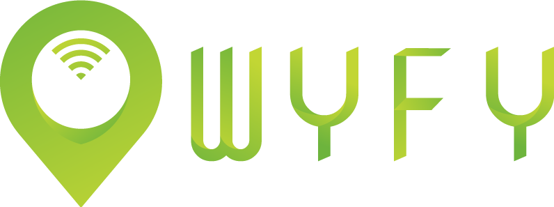

##  Your app to finding local free wifi hotspots based on your location or zipcode

### Meet the Team
<p align="center">

</p>

---
###  How to - Install WyFy

1.  Clone the Wyfy Repo to your local server using `git clone https://github.com/nss-day-cohort-24/wyfy.git` in your terminal

1.  This app is compiled with React JS.  Inside your terminal, enter `npm install` 

1.  Once installed, enter `npm start` in the terminal, which will load the browser with Wyfy

  
---
###  How to - Use Wyfy

1.  On load of the mobile ready Wyfy application, either enter a zip code or choose to allow geo-location permission.

1.  Once your location is found, use the map or the list to find a free, Nashville wi-fi hotspot location.

1.  Find out detailed information about the location by clicking on it in the list view.

1.  To get directions to the selected location, click `"get directions"` or click the pinpoint in the map.

1.  Save your favorite locations to your local storage for easy retrieval by tapping the "heart" icon in the location details.

  ---

###  See More Documentation on Wyfy


1.  You may see the Nashville Software School UX Design Presentation and also find out more information about the students who developed and designed this product [here.](https://docs.google.com/presentation/d/1hzcP6mZ8VRRLMNkoPzEpVLCnHZTT8RJB3w7otR1ex0I/edit?usp=sharing)

1.  You may find the detailed Styleguidist Component Site by entering `npx styleguidist server` inside your terminal .
---

###  Challenge Statement
>  How might we offer users the ability to discover local wifi resources from Nashville’s Open Data Portal based on their current location or zip code.
  
---
###  Minimum Viable Product Goals
 1. Remove Default Favicon and Title :P
 2. Interactive Map with Davidson County Wifi Locations as Pins
 3. Search Results in Map/List Split View
 4. Expandable Location Details in List View: Including
	 * Location Name
	* Location Type
	* Address
	* Distance from User Location
	* Phone Number
	* Image	
	* Hours of Operation
	* Printers Available
	* Duration of Use (If Applicable)
	* Parking Information
	* Option to Rate and/or Comment
	* Save Favorite Locations (Local Storage)
5. Navigation to Selected Wifi Hotspot Location through Favorite Navigation App
6. Zip Code Prompt Should User Not Wish To Enable Location Services
7. View, Edit, and Delete Favorite Wifi Locations
8. Prompt to Turn On Wifi Once User Has Arrived at Destination
---
### Stretch Goals (v2)
1. Weighted Rating System (Quality + Quantity)
2. Location List View Ascending By Distance From User and Displayed
3. User Can Upload Images of Location
4. Include Private Businesses & Volunteers in Future Locations
5. Capture User Data 
---
## React Component Overview
---

##### Logo
<p align="center">

</p>

```javascript
let Logo = (props) => {
    return (
        <div>
            
        </div>
    );
}
```

##### Search
<p align="center">

</p>

```javascript
<Input className="searchBar" type="search" name="search" id="search" placeholder="Search Type..." onKeyUp={this.search.bind(this)}/>
```
---

### Map

<p align="center">

</p>

```javascript
import React, {Component} from  'react';
import {GoogleApiWrapper, Map, Marker} from  'google-maps-react';
import  '../App.css';

var API_KEY =  'XXXXXXXXXXXXXXXXXXXXXXXXXXXXXX';

export  class  MapContainer  extends  Component {
	render()  {
	  return (
		<div className="map-flexbox">
		  <Map google={this.props.google}  zoom={14}  className="main-map">
			<Marker name={'Current location'}  />
		  </Map>
		</div>
		);
	}
}

export default  GoogleApiWrapper({
apiKey: (API_KEY)
})(MapContainer)
```
### Map Markers
```javascript
{
          this.props.data.map((item, index) => (
            <Marker
              key= {index}
              title={item.site_name}
              name={item.site_name}
              position={{lat: item.mapped_location.coordinates[1], lng: item.mapped_location.coordinates[0]}}
            />
          ))
        }
```
---
### Geolocation
```javascript
import { geolocated } from  'react-geolocated';

class  Geolocation  extends  React.Component {
	constructor(props){
		super(props);
	}
	componentDidMount(){
}
	getStuff(){
		!this.props.isGeolocationAvailable  ?  console.log("Browser does not support Geolocation")
		: !this.props.isGeolocationEnabled  ?  console.log("Geolocation is not enabled")
		: this.props.coords  ?  console.log("COORDS", this.props.coords, "LAT", this.props.coords.latitude, "LON", this.props.coords.longitude)
	}
	render()  {
		return (
			<button onClick={this.getStuff.bind(this)}>Get Location</button>
		)
	}
}
```
---

##### State
```javascript
class  NashData  extends  Component {  
	constructor(props)  {
		super(props);
			this.state = {
				data: null,
				DataIsLoaded: false,
				googleData: null,
				googleOpen:  "N/A",
				click: null,
				imgLink:  "https://vignette.wikia.nocookie.net/dumbway2sdie/images/5/5b/Kidneys2.gif/revision/latest?cb=20171219071357",
				googlePhone:"N/A",
				googleLoaded:false
			};
	}	
```
##### Fetch
```javascript
componentDidMount(){
	var component = this
	fetch("https://data.nashville.gov/resource/terb-nbm6.json")
	.then((resp)  => resp.json())
	.then(function(data) {
		component.setState({
		data: data,
		DataIsLoaded: true
		})
	}
	)
}
```
---
### BottomNav
<p align="center">

</p>

#### Geolocation Button
<p align="center">

</p>

##### Props

```javascript
constructor(props) {
        super(props);
        this.state = {
            geolocated:false,
            latitude: null,
            longitude:null
        }

        this.getLocation = this.getLocation.bind(this);

      }

      getLocation(coords){
        this.setState({
          geolocated:true,
          latitude: coords.latitude,
          longitude:coords.longitude
        })
        this.props.getLocation(coords);
    }
```
---
##### Render

```javascript
<Geolocation getLocation={this.getLocation}/>
```

All code and design of Wyfy© were developed by UX UI Design and Front-end Development Students, Cohort 24 2018.
